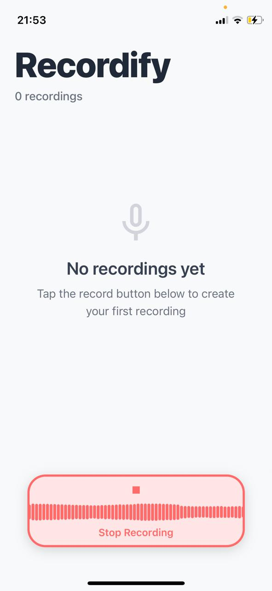

# Recordify

A simple audio recording app built with React Native and Expo, allowing users to record, play, and manage audio files with a smooth waveform visualization.

## Features
- Record audio with real-time waveform visualization
- Play back recordings with a progress bar and seek functionality
- Delete recordings easily
- Smooth animations for recording states
- Cross-platform support for iOS and Android

## Installation
1. Clone the repository:
   ```bash
   git clone https://github.com/nvps7/record.git
   ```
2. Navigate to the project directory:
   ```bash
   cd record
   ```
3. Install dependencies:
   ```bash
   npm install
   npx expo
   ```
4. Start the development server:
   ```bash
   npx expo start
   ```

## Usage
- **Start Recording**: Tap the "Start Recording" button to begin recording audio. The waveform will animate in real-time based on the audio input.
- **Stop Recording**: Tap the "Stop Recording" button to save the recording.
- **Play Recording**: Tap the play button on a recording card to listen to it. Use the progress bar to seek through the audio.
- **Delete Recording**: Tap the delete icon on a recording card to remove it.

## Screenshots

### iOS
  
  


### Android
  
  


## Dependencies
- `expo-av`: For audio recording and playback
- `expo-linear-gradient`: For gradient overlay effects
- `react-native-progress`: For the progress bar
- `react-native-vector-icons`: For icons

## Notes
- Ensure you have the Android NDK (e.g., version 26.3.11) properly installed and configured in `android/build.gradle` for Android builds.
- The app uses a custom dev client due to native module dependencies, so run `npx expo run:android` or `npx expo run:ios` to test locally.